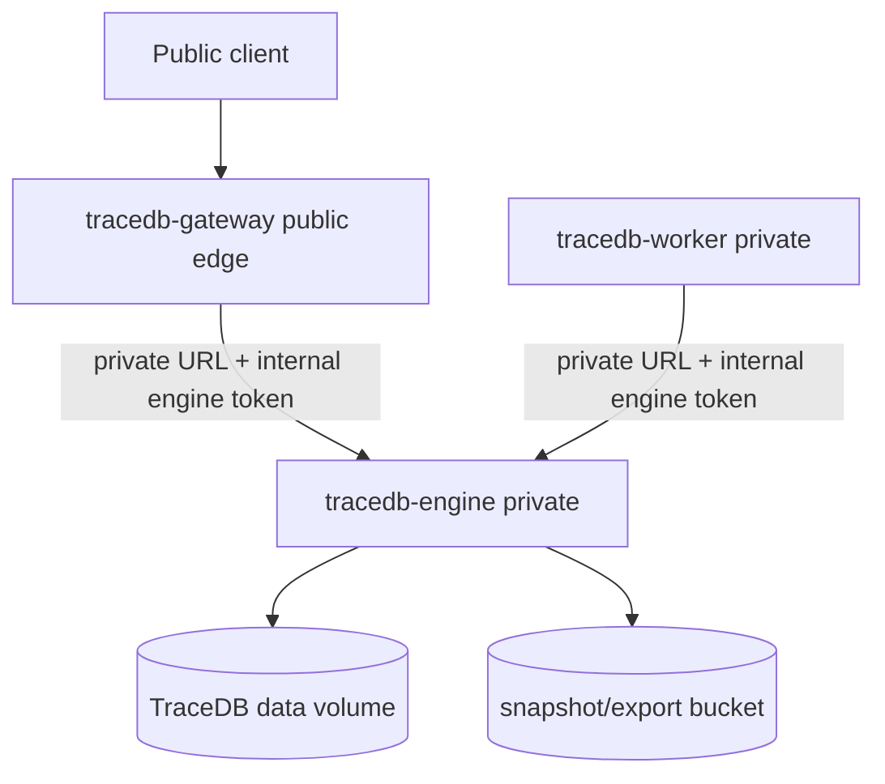

# Hosted Alpha Security Runbook

This runbook defines the security and operations boundary for a hybrid AWS +
Railway hosted-alpha deployment. It is documentation for controlled alpha
operation only. It is not a production security certification, managed-service
SLA, or disaster-recovery promise.

## Security Boundary Summary

Hard boundary rules:

- `tracedb-gateway` is the only intended public HTTP ingress for hosted alpha.
- `tracedb-engine` is private and owns the TraceDB data directory.
- `tracedb-worker` is private and mutates state only through the private engine
  API.
- Any direct public `tracedb-engine` endpoint is diagnostic-only, temporary, and
  must be removed before describing the environment as gateway-fronted hosted
  alpha.
- Hosted alpha services must run with `TRACEDB_HOSTED_ALPHA=true`.
- Public health, readiness, metrics, and logs must be sanitized before exposure.



## Public And Private Ingress

### Gateway-only public ingress

For hosted alpha, public DNS, Railway public domains, AWS ALB/API Gateway routes,
CloudFront distributions, and any customer-facing endpoint must point at
`tracedb-gateway`, not `tracedb-engine`.

The gateway is the hosted-alpha edge because it owns:

- API-key or bearer-token verification.
- Public route forwarding and request shaping.
- Public rate-limit and metering hooks.
- Public-safe responses for health, readiness, and metrics surfaces.

Expected gateway variables include:

```text
TRACEDB_HOSTED_ALPHA=true
TRACEDB_SERVICE_MODE=gateway
TRACEDB_REQUIRE_API_KEY=true
TRACEDB_API_TOKEN=<secret stored in provider secret manager>
TRACEDB_API_KEYS_PATH=<provider-mounted private path, optional invite-alpha registry>
TRACEDB_API_KEY_AUDIT_LOG_PATH=<provider-mounted private audit log path, optional>
TRACEDB_GATEWAY_ADMIN_TOKEN=<secret stored in provider secret manager, required for key admin routes>
TRACEDB_ENGINE_URL=http://<private-engine-host>:8080
TRACEDB_ENGINE_INTERNAL_TOKEN=<shared internal secret>
```

Clients and benchmark runners send the public API token as a bearer token. Local
operator tooling commonly uses `TRACEDB_HTTP_BEARER_TOKEN`; the gateway secret
that validates legacy shared-token access is `TRACEDB_API_TOKEN`.

When `TRACEDB_API_KEYS_PATH` is set, the gateway uses a file-backed invite-alpha
API-key registry instead of treating the hosted API as self-serve. The registry
stores only key hashes and metadata, not raw API keys. The one-time raw key is
returned only from the admin create route and must be copied directly into the
approved tester's secret store.

### Private engine

The engine must be reachable only over private networking in hosted alpha:

- Railway: use `*.railway.internal` for gateway and worker engine calls.
- AWS: place the engine in private subnets or private service networking with no
  public listener, and restrict security groups to gateway/worker sources.

Expected engine variables include:

```text
TRACEDB_HOSTED_ALPHA=true
TRACEDB_SERVICE_MODE=engine
TRACEDB_DATA_DIR=/data/tracedb
TRACEDB_SINGLE_WRITER=true
TRACEDB_ENGINE_INTERNAL_TOKEN=<shared internal secret>
```

`TRACEDB_HOSTED_ALPHA=true` makes the engine require an internal engine token.
Operators may also set `TRACEDB_REQUIRE_ENGINE_TOKEN=true` for explicitness, but
hosted alpha should not depend on the default.

### Direct public engine diagnostic only

A direct public engine endpoint is allowed only for a time-boxed diagnostic such
as disk validation or a benchmark bypassing the gateway path. Before enabling
it, create an operator note that includes:

- Why the gateway path cannot be used for this diagnostic.
- The exact public URL and service ID.
- Start time, planned removal time, and owner.
- Confirmation that `TRACEDB_ENGINE_INTERNAL_TOKEN` is set and known only to the
  operator tooling that needs the diagnostic.
- A removal check that deletes the public domain/listener after the diagnostic.

A public engine endpoint must never be used as evidence that hosted-alpha public
routing is ready. Hosted-alpha ingress evidence must target the gateway.

## Token Requirements

### Public API token and invite-alpha keys

Hosted-alpha public gateway requests require a bearer token:

```http
Authorization: Bearer <token>
```

Operational requirements:

- Set `TRACEDB_REQUIRE_API_KEY=true` on the gateway.
- For legacy one-token alpha, store `TRACEDB_API_TOKEN` only in Railway
  variables, AWS Secrets Manager, SSM Parameter Store, or a comparable secret
  manager.
- For invite-alpha testers, configure `TRACEDB_API_KEYS_PATH` and issue one
  `tdb_live_` key per tester through the gateway admin API.
- Store only the registry file and audit log on private provider storage. Do
  not commit either file.
- Generate long, random, environment-specific tokens.
- Do not reuse local, benchmark, staging, and customer-facing tokens.
- Rotate immediately after accidental exposure in logs, shell history, reports,
  or issue trackers.

Invite-alpha registry records track owner, optional email/org, scopes,
database/branch/tenant binding, status, creation time, last-used time, usage
count, and an optional request limit. This is enough for controlled alpha key
distribution. It is not a billing system, customer dashboard, credit ledger, or
self-serve cloud account model.

### Gateway API-key admin API

Gateway key-management routes are operator-only and require:

```http
Authorization: Bearer <TRACEDB_GATEWAY_ADMIN_TOKEN>
```

Supported invite-alpha routes:

- `POST /v1/gateway/api-keys`: creates a key and returns the raw `tdb_live_...`
  token once.
- `GET /v1/gateway/api-keys`: lists sanitized key metadata without hashes or raw
  tokens.
- `POST /v1/gateway/api-keys/revoke`: revokes a key by `key_id`.

The create body is JSON:

```json
{
  "owner": "alpha-tester",
  "email": "tester@example.com",
  "org": "example",
  "scopes": ["records:read", "records:write"],
  "database_id": "db_local",
  "branch_id": "db_local:main",
  "tenant_id": "tenant-a",
  "rate_limit_requests": 60000
}
```

Do not expose these admin routes through public dashboards or support tooling
until there is an operator approval gate and the audit log is retained.

### Internal engine token

Gateway and worker calls to the engine require `TRACEDB_ENGINE_INTERNAL_TOKEN`
(or the legacy fallback `TRACEDB_ENGINE_TOKEN`). Hosted alpha should use
`TRACEDB_ENGINE_INTERNAL_TOKEN` consistently.

Operational requirements:

- Set the same internal token on gateway, worker, and engine.
- Keep the token out of public clients and benchmark reports.
- Treat the token as more sensitive than a public API token because it authorizes
  internal engine access.
- Rotate it if any private service logs, environment dumps, or diagnostic
  artifacts may have exposed it.

## `TRACEDB_HOSTED_ALPHA=true`

Set `TRACEDB_HOSTED_ALPHA=true` on gateway, engine, and worker services for
hosted-alpha environments. This flag is the operator signal that the deployment
is in public/private hosted-alpha mode. In current engine code, it also forces
internal engine-token enforcement.

Do not set `TRACEDB_HOSTED_ALPHA=true` on unrelated local demos unless the
operator is intentionally testing the hosted-alpha boundary.

## Public Health, Readiness, And Metrics Sanitization

Public health and readiness routes are useful for uptime checks, but they must
not reveal sensitive deployment details. Public responses must avoid:

- Secret values, token fingerprints, DSNs, S3 credentials, or master-key state.
- Internal hostnames such as `*.railway.internal`.
- Absolute data paths such as `/data/tracedb` when not necessary.
- Tenant IDs, database IDs, branch IDs, user emails, or record content.
- WAL paths, snapshot paths, lock-file owner details, queue payloads, or catalog
  connection strings.

Use public-safe health/readiness/metrics responses for public routes. Keep deep
engine diagnostics private or require operator authentication. A public health
check should answer whether the edge is available, not disclose how to access or
attack private internals.

## Log And Secret Redaction

Logs, traces, benchmark reports, receipts, and support bundles must redact:

- `Authorization` headers.
- `TRACEDB_API_TOKEN`, `TRACEDB_HTTP_BEARER_TOKEN`,
  `TRACEDB_ENGINE_INTERNAL_TOKEN`, and `TRACEDB_ENGINE_TOKEN`.
- `TRACEDB_MASTER_KEY_B64` and any encryption or KMS material.
- Postgres DSNs, Redis/Valkey URLs with credentials, S3 access keys, AWS
  credentials, Railway tokens, OpenRouter keys, and competitor-service tokens.
- Request bodies that contain user records unless the artifact is explicitly a
  private test fixture.

Operational checks:

- Prefer environment-driven CLI invocations over command-line token arguments so
  secrets do not appear in shell history or process listings.
- Review generated manifests before sharing externally.
- Remove or redact provider environment dumps before attaching them to issues.
- Treat paths to private volumes and snapshots as sensitive operational metadata.

## Rate-limit Limitations And Provider Edge Controls

TraceDB gateway rate limiting is an alpha request-control layer, not complete
DDoS protection. It may depend on current process state, queue/cache backing,
provider behavior, and the active deployment topology. It should not be the only
control in front of public traffic.

Hosted-alpha deployments should also use provider edge controls:

- AWS: security groups, AWS WAF or API Gateway throttles, ALB listener rules,
  CloudFront request limits, IP allowlists for private diagnostics, and VPC-only
  access for engine/worker services.
- Railway: remove public domains from private services, use private networking,
  keep diagnostic public domains time-boxed, and apply any available provider
  request controls or upstream proxy controls.
- Both: set conservative request body limits, timeouts, concurrency limits, and
  alert on unusual 401/403/429/5xx spikes.

If a customer or benchmark requires higher traffic, document the expected rate,
window, and rollback plan before raising limits.

## Claim Boundaries

Hosted alpha does not currently claim:

- A public SLA or uptime guarantee.
- Managed disaster recovery, managed backups, or proven RPO/RTO.
- Cross-region failover or replicated consensus.
- Production-grade DDoS protection.
- SOC 2, HIPAA, PCI, GDPR compliance, or legal export/purge guarantees.
- Tenant isolation beyond the explicitly tested alpha gateway/catalog/engine
  paths.
- Complete TLS/HTTP/2/proxy-hardening behavior from TraceDB itself.
- Public direct-engine ingress.

External messaging must say `hosted alpha`, `controlled lab`, or equivalent
until these claims are separately implemented, tested, documented, and approved.
