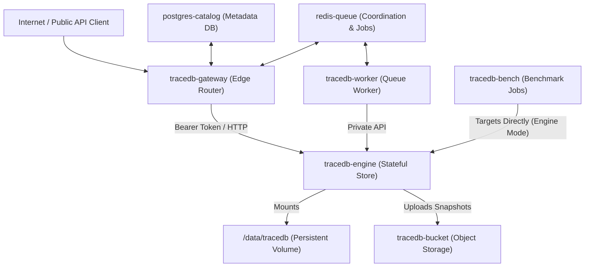
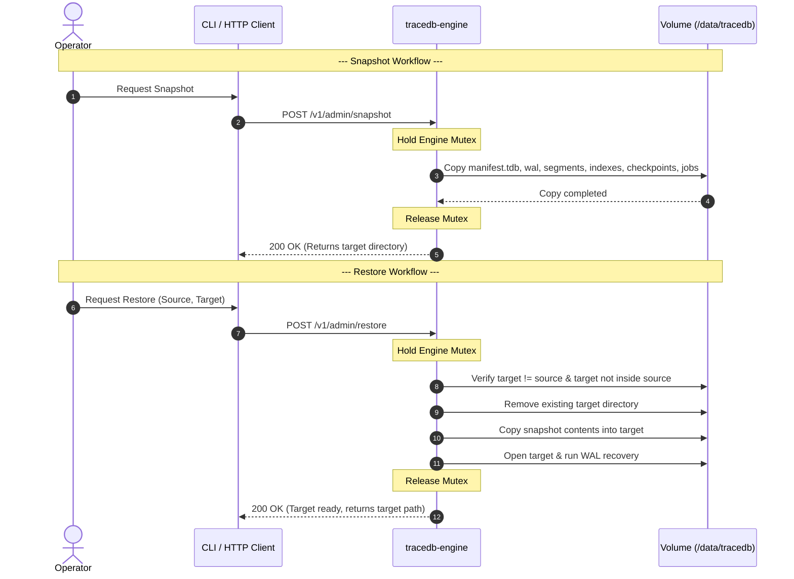

# Railway Operations and Topology

This document details the deployment topology, service routing configuration, storage volume mappings, object storage integration, and operational runbooks for TraceDB in the Railway lab environment. It describes a controlled hosted lab, not a production SaaS promise.

---

## 1. Service Topology and Roles

The TraceDB Railway deployment shape organizes components into discrete, decoupled roles. For benchmark and development tasks, stateful components run in Railway while control/orchestration resides on the client machine.



### Detailed Component Roles
1. **`tracedb-gateway` (Edge API Gateway):**
   * Acts as the only intended hosted-alpha public HTTP edge.
   * Handles API-key verification/bearer authorization, public route forwarding, rate limiting, and usage metering.
   * Keeps the private database engines protected behind internal routing.
2. **`tracedb-engine` (authoritative Storage Engine):**
   * Single-replica private stateful service.
   * Autoritative owner of the write-ahead log (WAL), schema catalog, active database indexes, data segments, and database recovery.
   * Initializes `/data/tracedb` at runtime (never pre-packaged during image compilation).
3. **`tracedb-worker` (Background Worker):**
   * Private worker that pulls tasks from queue services.
   * Interacts with the stateful engine strictly via the engine's private HTTP API.
4. **`postgres-catalog` (Metadata Catalog):**
   * Stores tenant control-plane metadata (databases, branches, users, organization IDs, and API tokens).
   * Does not store raw client database records.
5. **`redis-queue` / `valkey-queue` (Job & Lease Coordinator):**
   * A short-lived coordination store.
   * Holds lock leases, rate-limit counters, and background queues for compaction, indexing, feature extraction, and snapshotting.
6. **`tracedb-bucket` / `minio-bucket` (Object Storage):**
   * Long-term bucket storage used to house snapshots, exports, database backups, restore bundles, benchmark datasets, and diagnostic dumps.
   * *Not used* for hot WAL or active query paging.
7. **`tracedb-bench` (Benchmark Runner):**
   * Bounded jobs designed to run benchmark scenarios against direct HTTP targets (gateway or engine).
   * Direct engine targets are diagnostic-only and must not be presented as hosted-alpha ingress.

---

## 2. Service Network Routing

Private services communicate using internal dns resolution to avoid public egress costs and latency.

* **Internal DNS Pattern:** Stateful and worker services resolve each other inside Railway using the `*.railway.internal` domain name space.
* **Ports and Binding:**
  * Services check for the `TRACEDB_BIND` environment variable first, falling back to `PORT`, and defaulting to `8080`.
  * The gateway forwards queries internally using:
    ```text
    TRACEDB_ENGINE_URL=http://tracedb-engine.railway.internal:8080
    ```
  * The gateway allocates its public port after verifying the underlying engine is ready.
* **Authentication Boundary:**
  * Public requests to the gateway require a bearer token (`TRACEDB_HTTP_BEARER_TOKEN` or `TRACEDB_API_TOKEN`).
  * The engine-only benchmark bypasses the gateway by setting `TRACEDB_SERVICE_MODE=engine` and exposing a temporary public port on the engine itself. This public engine exposure is diagnostic-only for benchmark or disk validation runs; remove it before treating the environment as gateway-fronted hosted-alpha access.

### Role-Specific Environment Examples

Use the split templates under `deploy/railway/`:

* `env.gateway.example` for public gateway ingress and private engine routing.
* `env.engine.example` for the stateful engine volume and optional snapshot bucket.
* `env.worker.example` for private worker queue and engine routing.
* `env.benchmark.example` for benchmark runner targets and optional external controls.

Do not apply one role's full variable set to another service. Set tokens, DSNs,
and S3 credentials through Railway variables or CI secrets.

---

## 3. Persistent Volumes

Storage persistence is managed through dedicated Railway mounted volumes.

* **Mount Configuration:** A single volume mount is attached to the stateful engine service:
  * **Mount Path:** `/data`
  * **Engine Data Root:** `/data/tracedb` (configured via `TRACEDB_DATA_DIR=/data/tracedb`).
* **Strict Single-Writer Rule:**
  * Only `tracedb-engine` is permitted to mount and write to the TraceDB volume.
  * Gateway, worker, and benchmark services interact with the filesystem indirectly by sending HTTP REST mutations to the engine.

---

## 4. Snapshot and Restore Workflows

TraceDB uses local filesystem snapshots backed by WAL-replays to guarantee durability and consistency without active multi-writer coordination.



### Snapshot Creation
* **Endpoint:** `POST /v1/admin/snapshot` (or `TraceDb::create_snapshot` in the SDK).
* **Behavior:** Holds the internal engine write mutex to block incoming mutations while copying the active database directory.
* **Included Files:** Copies `manifest.tdb`, `engine.lock`, `wal/`, `hot/`, `segments/`, `indexes/`, `checkpoints/`, and `jobs/`.
* **Guardrails:** The target snapshot directory must be completely separate from the active database root.

### Snapshot Restore
* **Endpoint:** `POST /v1/admin/restore` (or `TraceDb::restore_snapshot` in the SDK).
* **Preconditions:**
  * The copy path guard rejects identical source and target paths.
  * The guard rejects target paths located inside the source tree structure. Rejections return a `source and target directories must differ` route error.
* **Behavior:**
  * Removes the existing target directory entirely before copying.
  * Copies the source snapshot into the target directory.
  * Opens the target directory as a fresh TraceDB instance, running the recovery pipeline.
* **Recovery Pipeline:**
  1. Reads `manifest.tdb` and verifies the manifest checksum.
  2. If `manifest.checkpoint_epoch` is non-zero, it reads the checkpoint file (`checkpoints/checkpoint-<epoch>.tchk`), verifies its checksum, and rebuilds records.
  3. Scans the WAL (`wal/000001.twal`), replaying all committed frames whose epoch is greater than the checkpoint epoch.
  4. If WAL replay discovers committed transactions beyond the manifest's `latest_epoch` (e.g. from an un-flushed crash), it advances the epoch and rewrites the manifest.

### Lock File Interventions
If a process crashes during a write, lock files may remain in the data directory and prevent further writes. Operators must verify that no other process is using the database and delete them manually:
* `engine.write.lock`: Lock file for database engine writes.
* `000001.twal.lock`: Lock file for WAL appends.
