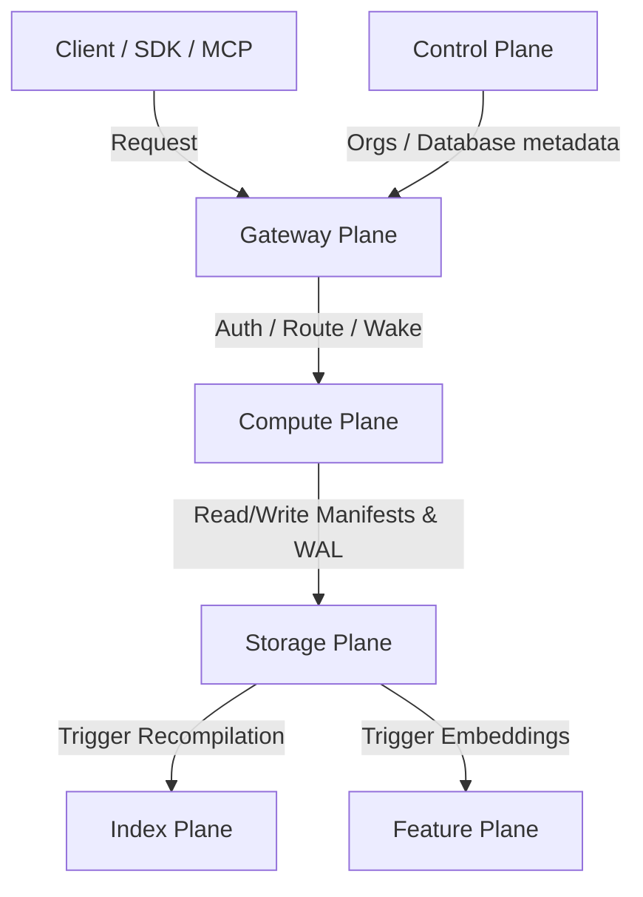

# Top-Down Architecture: TraceDB

## 1. The 6 Serverless Planes

Managed TraceDB separates compute from storage, allocating dedicated pools of stateless resources that scale independently or down to zero. The system is split into six logical planes:



### 1.1 Control Plane
*   **Responsibilities**: Manages organization accounts, user memberships, database/project metadata, branching states, billing details, deployment regions, and usage quotas.
*   **Alpha Implementation**: Built on a centralized database (`postgres-catalog`).

### 1.2 Gateway Plane
*   **Responsibilities**: Handles public HTTP/gRPC ingress, validates API tokens, resolves org/project/database/branch routes, enforces rate limits/quotas, shapes incoming requests, wakes sleeping compute workers, and streams JSON/gRPC responses.
*   **Alpha Implementation**: Stateless service (`tracedb-gateway`) that communicates with `tracedb-engine` over a private network.

### 1.3 Compute Plane
*   **Responsibilities**: Runs stateless, disposable workers to execute query ASTs, inserts, schema DDL modifications, data ingestion, and administrative API tasks. Workers load database branch manifests on-demand, cache pages locally, and release resources when idle.
*   **Alpha Implementation**: Stateful, single-replica private process (`tracedb-engine`) backed by a persistent Railway Volume.

### 1.4 Storage Plane
*   **Responsibilities**: Provides WAL commit ordering, writer lease management, and immutable segment publication.
    *   **TraceKeeper**: An active commit coordinator that assigns ordered transaction epochs, enforces single-writer leases per branch, and publishes log frames.
    *   **SegmentServer**: Exposes branch manifests and serves immutable segment/index blocks from object storage to compute workers.
    *   **Object Storage**: Authoritative target for manifests, segment files, and backup bundles.

### 1.5 Index Plane
*   **Responsibilities**: Offloads heavyweight indexing work (compiling HNSW graph files, BM25 text posting pages, graph adjacency mappings, and temporal range indexes) to elastic workers. Handles segment compaction (merging hot overlays into warm segments) and physical vacuuming of purged records.

### 1.6 Feature Plane
*   **Responsibilities**: Orchestrates the derived feature lifecycle, leasing background jobs to generate embeddings (via local models or external providers), extract entities, build summaries, and track model lineage.

---

## 2. Workspace & Crate Topology

The repository is structured as a Rust workspace with crates representing distinct modular boundaries:

*   `tracedb-core`: Common primitive definitions (RecordId, TableId, TenantId, Epoch, Lsn, Checksums) and shared error types.
*   `tracedb-kernel`: Transaction coordinator, visibility/policy oracle integration, module registry, recovery coordinator, and backup/restore coordinators.
*   `tracedb-module`: Standard extension traits and conformance test harness (`TypeModule`, `IndexModule`, `PlannerModule`, `StorageModule`, etc.).
*   `tracedb-std`: Standard module bundle and capability matrix.
*   `tracedb-schema`: Schema descriptors, DDL execution, table definitions, migrations, and schema-version validation.
*   `tracedb-log`: WAL record serialization, framing, checksumming, log rotation, and recovery replay.
*   `tracedb-store`: Multi-version concurrency control (MVCC), records body layouts, hot overlays, snapshot readers, and late record materialization.
*   `tracedb-segment`: Immutable segment encoding, page formats, metadata blocks, and compaction writers.
*   `tracedb-index`: Shared access-path traits, relational indexes (unique, range, prefix, bitmap), zone maps, and segment-level summaries.
*   `tracedb-text`: Standard text search module (tokenizers, postings list, BM25 scoring, exact terms).
*   `tracedb-vector`: Standard vector search module (metrics, exact scans, prefix dimensions, and freshness check).
*   `tracedb-graph`: Adjacency indexes, weighted/temporal traversals, policy filtering, and dynamic edge state.
*   `tracedb-policy`: Tenant isolation, ACL bitmaps, retention rules, and retrieval-safe pushdown filters.
*   `tracedb-provenance`: Citations, text span maps, parent-child record links, and audit history.
*   `tracedb-features`: Embedding status tracking, source hashes, model lineage registers, and feature job queues.
*   `tracedb-retrieval-core`: Suppression state and visibility-safe retrieval overlays.
*   `tracedb-memory-runtime`: Optional runtime module for activation, reinforcement, and stateful memory operations.
*   `tracedb-planner`: Query parsing, TraceQL compilation, logical plans, cost estimators, candidate fusion (RRF), and explain outputs.
*   `tracedb-query`: SQL-ish grammar parsing, expression evaluator, physical execution operators, and cursors.
*   `tracedb-jobs`: Durable job queue, leases, and workers for compactions or embeddings.
*   `tracedb-worker`: Thin CLI runner wrapper that consumes background jobs.
*   `tracedb-catalog`: Managed database/branch catalogs and routing info.
*   `tracedb-server`: Unix socket, HTTP, and gRPC server interfaces.
*   `tracedb-sdk`: Programming interface bindings (Rust, Python, TS).
*   `tracedb-cli`: Local management CLI.
*   `tracedb-bench`: Benchmark harness.
*   `tracedb-testkit`: Golden plans, synthetic test matrices, and crash injectors.

---

## 3. Directory Layouts

### 3.1 Local Directory Layout
In embedded and daemon modes, TraceDB stores its state in a single local directory:

```text
app.tracedb/
  engine.lock           # Database directory lock for process safety
  manifest.tdb          # Atomic copy-on-write manifest entry point
  wal/
    000001.twal         # Write-ahead log files
    000002.twal
  hot/                  # Hot tier mutable overlays
    rows/               # Volatile record versions
    text/               # Volatile BM25 posting overlays
    vectors/            # Volatile exact vector overlays
    policy/             # Volatile policy checks
    features/           # Volatile feature states
  segments/
    000001.tseg         # Sealed immutable segments
    000002.tseg
  indexes/
    primary/
    relational/
  snapshots/            # Local backup points
  jobs/                 # Job lease queue files
  backups/
  tmp/                  # Scratch directory for compaction staging
```

### 3.2 Serverless S3 Namespace Layout
In managed cloud deployments, immutable files are published to object storage, organized by database and copy-on-write branch:

```text
s3://tracedb/
  orgs/{org_id}/
    dbs/{database_id}/
      branches/{branch_id}/
        manifests/
          manifest_00000001.tdb  # Versioned branch manifests
        wal/
          00000001.twal          # WAL archives
        segments/
          00000001.tseg          # Columnar pages and module blocks
        indexes/
          hnsw_00000001.tidx     # Pre-built index files
        snapshots/
        jobs/
```

---

## 4. Write-Ahead Log (WAL)

TraceDB uses a single append-only Write-Ahead Log to record all transactional mutations before updating memory state.

### 4.1 WAL Frame Format
Every update is written as a length-delimited frame containing validation metadata:

```rust
struct WalFrame {
    magic: u32,
    format_version: u32,
    lsn: Lsn,
    prev_checksum: Checksum,
    frame_kind: WalFrameKind,
    payload_len: u32,
    payload_checksum: Checksum,
    frame_checksum: Checksum,
}
```

### 4.2 Logged vs. Derived State
The WAL logs logical changes (`INSERT_RECORD`, `UPDATE_RECORD`, `DELETE_RECORD`, `MARK_FEATURE_DIRTY`, `SCHEDULE_FEATURE_JOB`). Physical index updates (like building HNSW trees or updating postings lists) are derived asynchronously. If database indexes are damaged, they are reconstructed by scanning the segments and WAL.

### 4.3 Commit Epochs & Recovery
1.  **Commit**: Transactions reserve a monotonically increasing `Epoch`. The WAL frame is written and fsynced.
2.  **Overlays**: Replayed mutations instantly populate hot memory overlays so they are immediately queryable.
3.  **Crash Recovery**:
    *   Find the active WAL files declared in the branch manifest.
    *   Scan frames sequentially, verifying Lsn sequences and checksums.
    *   Stop at the first corrupt or incomplete frame (ignoring uncommitted tail-writes).
    *   Replay mutations to reconstruct hot overlays and re-register pending feature jobs.

---

## 5. Manifest Publication

`manifest.tdb` acts as the directory's transactional entry point.

### 5.1 Copy-on-Write Publication
To guarantee crash safety, the manifest is never updated in-place:
1.  Compute a new `TraceDbManifest` struct containing active segment, index, and branch states.
2.  Write the manifest to a temporary file (`tmp/manifest.tdb.tmp`).
3.  Fsync the temporary file to disk.
4.  Rename the temporary file over `manifest.tdb` (an atomic operation on POSIX filesystems).
5.  Fsync the parent database directory.

### 5.2 Compare-and-Swap in Managed Mode
In serverless mode, the manifest update is published through a compare-and-swap (CAS) operation in the catalog service, preventing concurrent writes from clobbering branch lineage.

### 5.3 Reader Pinning
Queries open a `ReadSnapshot` by reading the latest manifest and locking the current `latest_epoch` and manifest generation. Background compactions can create new segment configurations and delete obsolete files, but the physical files are pinned on disk until the oldest active reader releases its manifest snapshot pin.

---

## 6. MVCC Model

Multi-version concurrency control is epoch-based, providing snapshot isolation without table-level locking.

### 6.1 Version Headers
Every record version has metadata tracking its lifecycle:

```rust
struct RecordVersionHeader {
    record_id: RecordId,
    version_id: VersionId,
    begin_epoch: Epoch,
    end_epoch: Option<Epoch>,
    tombstone: Option<TombstoneKind>,
}
```

*   An insert sets `begin_epoch` to the current transaction epoch and `end_epoch` to `None`.
*   An update closes the active version by setting `end_epoch` to the update transaction's epoch, then appends a new `RecordVersion` with `begin_epoch` set to that transaction's epoch.
*   A delete sets `end_epoch` and logs a tombstone.

### 6.2 Snapshot Visibility Rule
A reader with snapshot epoch `read_epoch` determines version visibility using the following rule:

$$\text{begin\_epoch} \le \text{read\_epoch} \quad \text{AND} \quad (\text{end\_epoch} = \text{None} \quad \text{OR} \quad \text{end\_epoch} > \text{read\_epoch})$$

### 6.3 Isolation Levels
*   **READ_COMMITTED**: Opens a new read snapshot epoch for each query statement.
*   **SNAPSHOT**: Pins a single read snapshot epoch for the lifetime of the transaction.
*   **SERIALIZABLE_LITE**: Combines SNAPSHOT reads with optimistic write validation. Writes check for table/row write conflicts occurring between the transaction start epoch and commit epoch. Approximate ANN query paths record search parameters and returned sets to audit potential serialization anomalies.
