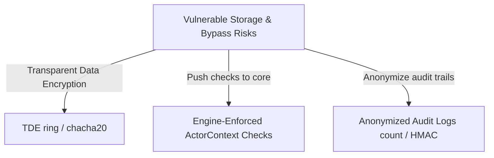

# Legal, Safety, & Compliance Review: Kernel Governance vs. Storage Vulnerabilities

This report evaluates TraceDB's capabilities in security-by-design, data governance, and regulatory compliance (GDPR, EU AI Act, HIPAA, SOC 2). It synthesizes the debate between **The Compliance Advocate** (commending kernel-enforced AI policies and audit logs) and **The Security Critic** (exposing unencrypted storage, engine-layer policy bypasses, and audit metadata leakage).

---

## 1. Thesis: The Compliance Advocate's View on Kernel-Enforced AI Governance

TraceDB introduces built-in compliance checks at the database layer, resolving the risk of sensitive data leakage common in application-level filtering.

### A. Integrated Security Policies (`tracedb-policy`)
The `Policy` struct (defined in [lib.rs](file:///Users/zgrogan/Repos/tracedb/crates/tracedb-policy/src/lib.rs#L39-L50)) elevates security policies to first-class database primitives:
*   **Row-Level & Tenant Isolation:** Multi-tenant boundaries are enforced using `tenant_id` and granular Access Control Lists (`AclEntry`).
*   **AI Safety Toggles:** Fields like `suppress_from_ai`, `allow_embedding`, and `allow_training` control whether data can be processed by LLMs, indexed in vector spaces, or used for model fine-tuning.
*   **Visibility Filtration:** The `VisibilityOracle` (see [lib.rs](file:///Users/zgrogan/Repos/tracedb/crates/tracedb-policy/src/lib.rs#L111-L146)) checks access credentials (`ActorContext`) and filters out records flagged with `suppress_from_ai`.

### B. Traceability & Lineage (`tracedb-provenance`)
TraceDB tracks data lifecycle and lineage to ensure auditable data processing:
*   **Data Lineage:** The `Provenance` struct (see [lib.rs](file:///Users/zgrogan/Repos/tracedb/crates/tracedb-provenance/src/lib.rs#L9-L16)) maps synthetic/derived records back to their `source_uri` and parent records.
*   **Immutable Retrieval Auditing:** The `RetrievalAudit` struct (see [lib.rs](file:///Users/zgrogan/Repos/tracedb/crates/tracedb-provenance/src/lib.rs#L30-L38)) generates audit trails of read epochs, access paths, and suppressed records, allowing organizations to prove compliance with data access policies.

### C. Point-in-Time Auditing (`tracedb-temporal`)
To support retroactive audits, `tracedb-temporal` maps data modifications to sequential transaction epochs. Using the `as_of` temporal query path (see [lib.rs](file:///Users/zgrogan/Repos/tracedb/crates/tracedb-temporal/src/lib.rs#L30-L32)), compliance officers can reconstruct the database state at any point in history, verifying what information was visible to an AI model at the time of a request.

---

## 2. Antithesis: The Security Critic's View on Storage and Engine Enforceability Gaps

Despite the built-in policy structs, the physical database implementation contains structural security flaws and enforcement gaps that introduce bypass risks.

### A. Unencrypted Plain-Text Storage at Rest (GDPR Art. 32 Violation)
TraceDB stores data segments on disk without encryption.
*   **Plain JSON Serialization:** In [lib.rs](file:///Users/zgrogan/Repos/tracedb/crates/tracedb-segment/src/lib.rs#L213-L229), the database serializes records as standard pretty-printed JSON (`serde_json::to_vec_pretty`) and writes them directly to `.tseg` files.
*   **Physical Exposure:** The write path exposes sensitive fields, document paths, source code, and float-heavy vector arrays in plain text (see [lib.rs](file:///Users/zgrogan/Repos/tracedb/crates/tracedb-segment/src/lib.rs#L30-L39)). Anyone with disk read access can extract all data, bypassing all database permissions.

### B. Core Engine-Layer Policy Enforcement Bypass
The database core does not evaluate the policy or visibility schemas, delegating validation to the outer API or gateway layer.
*   **Unprotected Core Query API:** The core query entrypoint `TraceDb::query_with_timing` accepts a `HybridQuery` input (see [lib.rs](file:///Users/zgrogan/Repos/tracedb/crates/tracedb-query/src/lib.rs#L960-L974)), which does not contain user credentials, actor tokens, or policy schemas. The query engine simply returns all records matching the tenant ID (see [lib.rs](file:///Users/zgrogan/Repos/tracedb/crates/tracedb-query/src/lib.rs#L996-L1001)).
*   **Direct API Bypasses:** The API server exposes a direct JSON endpoint `/v1/query` that accepts raw query payloads (see [lib.rs](file:///Users/zgrogan/Repos/tracedb/crates/tracedb-server/src/lib.rs#L385-L389)). An attacker who can access the private network or send payloads directly to the database port can query any tenant's records without triggering the `VisibilityOracle` check.

### C. Audit Log Metadata Leakage (SOC 2 CC6.8 Violation)
The `RetrievalAudit` schema logs suppressed record IDs to confirm security filtering (see [lib.rs](file:///Users/zgrogan/Repos/tracedb/crates/tracedb-provenance/src/lib.rs#L30-L38)).
*   **Covert Channel Leak:** Recording `suppressed_ids` in audit logs leaks the existence of classified records. An unauthorized user can verify a document's existence by looking for its ID in the suppressed records list.
*   **Unsecure Log Storage:** These audit logs are stored in standard, unencrypted `.tseg` segment files on disk, exposing query histories to anyone with filesystem access.

---

## 3. Synthesis: Security & Compliance Remediation Roadmap

To resolve these vulnerabilities and meet enterprise regulatory standards, we propose the following compliance remediation plan:

1.  **Transparent Data Encryption (TDE):** Integrate cryptographic libraries (such as `ring` or `chacha20poly1305`) into `tracedb-segment` to encrypt all `.tseg` files and WAL frames before they are flushed to disk.
2.  **Push Access Checks to the Storage Kernel:** Refactor `TraceDb::query_with_timing` to require an `ActorContext` parameter. Modify the physical execution plan to run the `VisibilityOracle` check at the moment of candidate materialization, ensuring security is enforced by the database core.
3.  **Anonymize Audit Logs:** Redesign the `RetrievalAudit` schema to protect metadata. Replace raw suppressed keys with simple count statistics (`suppressed_count: usize`) or cryptographically hashed IDs (`HMAC-SHA256(record_id, salt)`) to prevent metadata leakage.
4.  **Secure the Internal API Server:** Disable direct `/v1/query` routes on `tracedb-server` when running in gateway mode, forcing all queries to route through the auth-enforced `tracedb-gateway` ingress.
