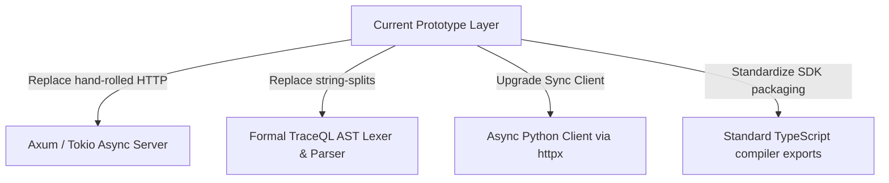

# Developer & Architecture Review: The Code Correctness vs. Friction Debate

This report synthesizes the deep code-level debate between **The Purist** (advocating for compile-time safety and modular Rust design) and **The Pragmatist** (highlighting developer experience friction, hand-rolled web servers, and client packaging limitations) regarding the TraceDB codebase.

---

## 1. Thesis: The Purist's View on Code Health & Compile-Time Correctness

The TraceDB codebase exhibits a high level of systems engineering discipline, relying on Rust's type system to enforce database invariants at compile time rather than relying solely on runtime checks.

### A. Zero-Unsafe Safety Guarantee (`#![forbid(unsafe_code)]`)
To prevent memory corruption, data races, and typical database security vulnerabilities (such as buffer overflows), every crate in the workspace enforces compiler-level safety. This is verified by the strict forbid lint declared at line 1 of the following core modules:
*   Core Engine Definitions: [lib.rs](file:///Users/zgrogan/Repos/tracedb/crates/tracedb-core/src/lib.rs#L1)
*   Transactional Storage Engine: [lib.rs](file:///Users/zgrogan/Repos/tracedb/crates/tracedb-store/src/lib.rs#L1)
*   Modular Extension System: [lib.rs](file:///Users/zgrogan/Repos/tracedb/crates/tracedb-modules/src/lib.rs#L1)
*   Client SDK Implementations: [lib.rs](file:///Users/zgrogan/Repos/tracedb/crates/tracedb-sdk/src/lib.rs#L1)
*   Schema Validator: [lib.rs](file:///Users/zgrogan/Repos/tracedb/crates/tracedb-schema/src/lib.rs#L1)

By guaranteeing the absence of `unsafe` blocks, TraceDB delegates memory safety entirely to the compiler, eliminating class-wide CVEs and rendering runtime crashes deterministic.

### B. Correct-by-Construction Schema Invariant Engine
TraceDB avoids using weakly typed configurations for table layout. It structures database columns using the strict `LogicalType` algebraic enum in [lib.rs](file:///Users/zgrogan/Repos/tracedb/crates/tracedb-schema/src/lib.rs#L6-L31). Tables are verified through exhaustive check functions prior to query execution:
*   **Logical Validation:** The validation engine in [lib.rs](file:///Users/zgrogan/Repos/tracedb/crates/tracedb-core/src/lib.rs#L172-L258) rejects invalid column definitions, checks for distinct identity/tenant keys, and verifies vector dimensional constraints.
*   **GraphQL Safety:** Schema compilation rejects fields matching reserved GraphQL words or containing unsafe naming syntax to avoid introspection collisions (see [lib.rs](file:///Users/zgrogan/Repos/tracedb/crates/tracedb-core/src/lib.rs#L286-L308)).
*   **Integrity Guards:** The database store checks record inputs at ingestion to ensure dimensional consistency before updates touch the write path (see [lib.rs](file:///Users/zgrogan/Repos/tracedb/crates/tracedb-store/src/lib.rs#L764-L778)).

### C. Fluent, Injection-Safe Client Builders
Rather than forcing developers to compose raw, error-prone query strings, the SDK exposes the fluent `QueryBuilder` (aliased as `TableHandle`) in [lib.rs](file:///Users/zgrogan/Repos/tracedb/crates/tracedb-sdk/src/lib.rs#L1731-L2105). This builder model enforces parameter constraints (such as forcing the definition of a `tenant_id` for multi-tenant isolation, see [lib.rs](file:///Users/zgrogan/Repos/tracedb/crates/tracedb-sdk/src/lib.rs#L2058-L2067)) and serializes parameters safely, avoiding injection vulnerabilities.

---

## 2. Antithesis: The Pragmatist's View on DX Friction & Gaps

While the internal core traits are robust, the database's outer boundary suffers from significant developer friction, non-standard API designs, and hand-rolled infrastructure that impacts performance and reliability.

### A. Hand-Rolled, Blocking HTTP Network Layer
The network daemon implemented in [lib.rs](file:///Users/zgrogan/Repos/tracedb/crates/tracedb-server/src/lib.rs) utilizes a primitive thread-per-connection model.
*   **OS Thread Exhaustion:** The server spawns a new OS-level thread for every incoming connection in `spawn_handler` (see [lib.rs](file:///Users/zgrogan/Repos/tracedb/crates/tracedb-server/src/lib.rs#L193-L197)). This model fails under high-concurrency loads and leaves the engine vulnerable to DoS attacks.
*   **Fragile Header Parsing:** HTTP/1.1 parsing is performed manually via naive string splits and index searches (see [lib.rs](file:///Users/zgrogan/Repos/tracedb/crates/tracedb-server/src/lib.rs#L591-L647)). If the body content itself contains the sequence `\r\n\r\n`, the body-slicing logic fails, corrupting payload delivery.
*   **Protocol Deficiencies:** The hand-rolled server lacks keep-alive connection reuse, TLS encryption, and CORS configuration support.

### B. Lack of Standard SQL & Database Ecosystem Integration
TraceDB provides no standard SQL parser, completely omitting database driver compatibility.
*   **Mock SELECT Parsing:** The SQL-ish parser in [lib.rs](file:///Users/zgrogan/Repos/tracedb/crates/tracedb-query/src/lib.rs#L4024-L4125) only supports simple `SELECT *` structures. It explicitly rejects relational clauses like `JOIN`, `GROUP BY`, `ORDER BY`, or `UNION` (see [lib.rs](file:///Users/zgrogan/Repos/tracedb/crates/tracedb-query/src/lib.rs#L4127-L4139)).
*   **Ecosystem Isolation:** Standard tools (like ORMs, BI dashboards, or migration tools) cannot integrate with TraceDB. Developers must learn a custom query format (`TraceQL`), increasing cognitive load.

### C. Non-Compliant GraphQL Query Rewriter
Rather than executing queries via a spec-compliant resolver, TraceDB uses a custom text rewriter to map GraphQL queries to `HybridQuery` structures (see [lib.rs](file:///Users/zgrogan/Repos/tracedb/crates/tracedb-query/src/lib.rs#L3600-L3750)).
*   **Missing Core Features:** The adapter explicitly forbids GraphQL variables ([lib.rs](file:///Users/zgrogan/Repos/tracedb/crates/tracedb-query/src/lib.rs#L3652)), fragments ([lib.rs](file:///Users/zgrogan/Repos/tracedb/crates/tracedb-query/src/lib.rs#L3688)), query aliases ([lib.rs](file:///Users/zgrogan/Repos/tracedb/crates/tracedb-query/src/lib.rs#L3700)), and introspection.
*   **Envelope Incompatibility:** The server returns the database's canonical `QueryResponse` envelope (see [lib.rs](file:///Users/zgrogan/Repos/tracedb/crates/tracedb-server/src/lib.rs#L418)) instead of standard GraphQL JSON formats, breaking compatibility with standard clients (e.g., Apollo Client).

### D. Client SDK Packaging Limitations
*   **Python SDK:** The client in [client.py](file:///Users/zgrogan/Repos/tracedb/clients/python/tracedb/client.py#L159) implements only synchronous, blocking operations using standard `urllib.request`. This forces application developers to wrap calls in thread pools when using modern asynchronous Python web runtimes like FastAPI.
*   **TypeScript SDK:** The build configuration requires a post-compilation declaration hacking script `rewrite-declaration-imports.mjs` to rewrite imports in `.d.ts` files from `.ts` to `.js` ([package.json](file:///Users/zgrogan/Repos/tracedb/clients/typescript/package.json#L29)), introducing brittle dependencies to the compilation pipeline.

---

## 3. Synthesis: Architectural Resolution & Roadmap

To transition TraceDB from an alpha prototype to a production-ready enterprise database, we propose the following evolutionary roadmap that retains the type-safe core while eliminating outer-boundary friction:

1.  **Refactor Server to Async Axum/Tokio:** Deprecate the thread-per-connection model. Replacing the hand-rolled TCP parser with `axum` and `tokio` will introduce connection pooling, native TLS, robust HTTP validation, and prevent denial-of-service thread exhaustion.
2.  **Formalize TraceQL Grammar:** Shift from string-splitting parsers to a formal AST parser built using standard parser-generator crates (e.g., `lalrpop` or `nom`). This will provide developers with detailed syntax errors and protect the database against compiler injection bypasses.
3.  **Upgrade the Python Client:** Rebuild the Python SDK using `httpx` to support both asynchronous (`async/await`) and synchronous client connections natively.
4.  **Standardize SDK Build Pipelines:** Clean up the TypeScript build scripts, migrating from custom regex rewriters to standard TypeScript project references and modern bundling tools (e.g., `tsup` or `rollup`).
