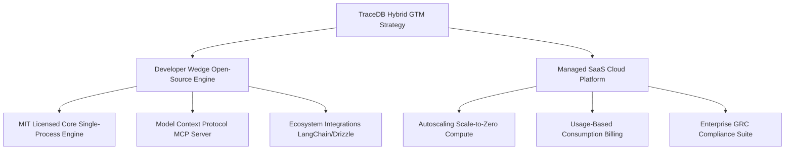

# Product & Go-To-Market Review: Open-Core PLG vs. Closed-Core SaaS Cloud API

This report evaluates TraceDB's productization and commercialization path, synthesizing the debate between **The Open-Core Advocate** (promoting bottom-up developer trust and open-source integrations) and **The SaaS Advocate** (arguing for a closed-core hosted SaaS cloud API to abstract away operational bottlenecks and enforce enterprise compliance).

---

## 1. Thesis: The Open-Core PLG Strategy

Releasing the core database engine under a permissive open-source license (MIT/Apache 2.0) is the most effective way to capture developer mindshare and bypass corporate procurement friction.

### A. Modular Open-Source Core Layout
The database workspace is already configured with an MIT license in [Cargo.toml](file:///Users/zgrogan/Repos/tracedb/Cargo.toml#L42). Releasing these core crates allows developers to run TraceDB in local testing suites for free:
*   **`tracedb-core`:** Core schemas and table validators (see [lib.rs](file:///Users/zgrogan/Repos/tracedb/crates/tracedb-core/src/lib.rs#L163-L170)).
*   **`tracedb-store` & `tracedb-log`:** Durability logic, write-ahead logs, and MVCC structures.
*   **`tracedb-query` & `tracedb-planner`:** Lexical/vector stream fusion and TraceQL parsing.

### B. Bootstrapping Ecosystem Integrations
To establish TraceDB as the default transactional memory layer for AI, the GTM prioritizes integrations with:
*   **AI Orchestration Frameworks:** First-party connectors for **LangChain** and **LlamaIndex** to serve as semantic memory engines.
*   **Modern ORMs:** Integrations for **Prisma**, **Drizzle**, and **SQLAlchemy** to simplify schema mappings.
*   **Model Providers:** Auto-triggering embedding updates using `tracedb-features` background job queues linked to OpenAI and Hugging Face APIs.

### C. Database Branching as a DX Driver
Leveraging the catalog branching model (see [lib.rs](file:///Users/zgrogan/Repos/tracedb/crates/tracedb-catalog/src/lib.rs#L28-34)), developers can branch production databases to run local staging tests, accelerating development velocity.

---

## 2. Antithesis: The Closed-Core SaaS Cloud API Strategy

Self-hosting TraceDB introduces significant operational complexity and reliability risks, making a closed-core hosted cloud API the only viable production path.

### A. The Operational Overhead of Self-Hosting
*   **Thread Exhaustion:** The server spawns a new OS-level thread for every TCP connection accepted (see [lib.rs](file:///Users/zgrogan/Repos/tracedb/crates/tracedb-server/src/lib.rs#L193-L197)), which scales poorly.
*   **Global Lock Contention:** All operations are serialized behind a global mutex lock `Arc<Mutex<TraceDb>>` (see [lib.rs](file:///Users/zgrogan/Repos/tracedb/crates/tracedb-server/src/lib.rs#L385-L451)).
*   **Manual Recovery Interventions:** Process crashes leave stale lock files (`engine.write.lock`) on disk, requiring manual administrator intervention to delete (see [durability-semantics-v0.md](file:///Users/zgrogan/Repos/tracedb/docs/durability-semantics-v0.md#L159-L167)).
*   **Blocking Backups:** Creating snapshots blocks all active reads and writes (see [lib.rs](file:///Users/zgrogan/Repos/tracedb/crates/tracedb-server/src/lib.rs#L456-L469)).

### B. Gateway-Routing & Serverless Scaling
A hosted SaaS cloud abstracts these deployment details:
*   **The Gateway Abstraction:** The `tracedb-gateway` service (see [lib.rs](file:///Users/zgrogan/Repos/tracedb/crates/tracedb-gateway/src/lib.rs#L101-L129)) routes client API requests to private backend instances based on logical IDs, hiding physical database topologies.
*   **Autoscaling Scale-to-Zero Compute:** Using catalog branch states (such as `Active`, `Idle`, `Warming`, `Suspended` defined in [lib.rs](file:///Users/zgrogan/Repos/tracedb/crates/tracedb-catalog/src/lib.rs#L9-L15)), the cloud operator can shut down compute instances when idle, spin them up on demand, and run background worker jobs (`tracedb-worker`) asynchronously.

### C. The GRC SaaS Compliance Moat
Enterprise security teams require certified compliance endpoints (SOC 2, ISO 27001, HIPAA). A managed SaaS platform acts as the trusted proxy that enforces policy logic (such as row-level isolation, AI training suppression, and data retention defined in [lib.rs](file:///Users/zgrogan/Repos/tracedb/crates/tracedb-policy/src/lib.rs#L39-L50)) and records tamper-proof audit trails (see [lib.rs](file:///Users/zgrogan/Repos/tracedb/crates/tracedb-provenance/src/lib.rs#L30-L38)).

---

## 3. Synthesis: The Dual-Motion Hybrid Open-Core GTM Plan

To maximize adoption while securing high-value enterprise revenue, TraceDB should adopt a **dual-motion hybrid open-core business model**:

### A. The Product Tiering Structure
1.  **TraceDB Core (Open Source - MIT/Apache 2.0):**
    *   *Features:* Single-node embedded engine, memory storage, local CLI, basic text search, exact vector search, client SDKs, and Model Context Protocol (MCP) server.
    *   *Value:* Captures developer adoption, establishes community trust, and embeds TraceDB in local pipelines.
2.  **TraceDB Cloud (SaaS - Consumption-Based Consumption):**
    *   *Features:* Decoupled compute/storage, autoscaling scale-to-zero compute branches, managed backups, and multi-tenant gateway routing.
    *   *Value:* Resolves self-hosting operational bottlenecks for scaling production apps.
3.  **TraceDB Enterprise (Commercial SaaS/On-Prem License):**
    *   *Features:* Enterprise Governance Suite (`tracedb-policy` and `tracedb-provenance` capabilities, row-level ACLs, audit logs, and AI training suppression), high-scale indexing, VPC peering, and SOC 2 compliance.
    *   *Value:* Captures mandatory corporate risk compliance budgets.

### B. Telemetry-Based Usage Billing
Monetize SaaS tiering using database usage metrics tracked in [lib.rs](file:///Users/zgrogan/Repos/tracedb/crates/tracedb-metering/src/lib.rs#L7-L15):
*   **Compute Usage:** Billed based on `ComputeMs` (scaling compute to zero when idle).
*   **Vector Operations:** Billed per million `VectorDistanceUnit` operations.
*   **AI Pipelines:** Billed per `EmbeddingJobUnit` execution (embedding generation on write).
*   **Storage Volume:** Billed per `StorageByte` (with discounted rates for copy-on-write `BranchDeltaByte` storage).
