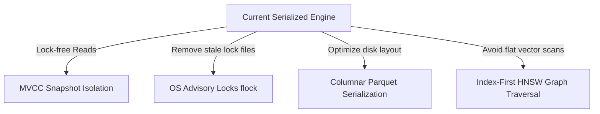

# Infrastructure & Scaling Review: Decoupled Topology vs. Real-world Bottlenecks

This report evaluates the infrastructure scalability, ops orchestration, and runtime limitations of TraceDB, synthesizing the debate between **The Cloud Scaler** (commending the distributed multi-plane topology) and **The Systems Realist** (analyzing critical concurrency, serialization, and disk I/O bottlenecks).

---

## 1. Thesis: The Cloud Scaler's View on Decoupled Topology & Orchestration

From a high-level systems design perspective, TraceDB separates compute, storage, routing, and queue processing. This allows independent scaling of individual planes in a distributed deployment.

### A. The 6-Plane Serverless Architecture
As outlined in the architecture documentation [top-down.md](file:///Users/zgrogan/Repos/tracedb/docs/architecture/top-down.md#L5-L16), TraceDB can be partitioned into six distinct resource planes:
1.  **Control Plane:** Manages database/branch metadata catalog tables.
2.  **Gateway Plane:** Edge API ingress handling authentication and query routing.
3.  **Compute Plane:** Ingestion parsing and query execution.
4.  **Storage Plane:** Commit coordination, WAL logging, and segment storage.
5.  **Index Plane:** Asynchronous background compaction and index updates.
6.  **Feature Plane:** Background embedding generation and text indexing.

### B. Gateway-Edge Routing & Security Ingress
The `tracedb-gateway` crate (see [lib.rs](file:///Users/zgrogan/Repos/tracedb/crates/tracedb-gateway/src/lib.rs)) acts as a stateless routing edge:
*   **Dynamic Route Mapping:** It intercepts client traffic, verifies bearer auth tokens, resolves projects and organization scopes, and proxies the query downstream to the target engine (see [lib.rs](file:///Users/zgrogan/Repos/tracedb/crates/tracedb-gateway/src/lib.rs#L101-L130)).
*   **Request Metering & Protection:** It enforces rate limits using an in-memory `UsageMeter` (see [lib.rs](file:///Users/zgrogan/Repos/tracedb/crates/tracedb-gateway/src/lib.rs#L138-L166)), returning HTTP 429 Too Many Requests under heavy load.

### C. Background Task Offloading
Heavy calculations (such as index compactions and embedding updates) are offloaded to asynchronous workers:
*   **Queued Background Workloads:** The `tracedb-worker` (see [lib.rs](file:///Users/zgrogan/Repos/tracedb/crates/tracedb-worker/src/lib.rs)) pulls jobs from a Valkey-backed queue catalog managed by `tracedb-jobs` (see [lib.rs](file:///Users/zgrogan/Repos/tracedb/crates/tracedb-jobs/src/lib.rs)).
*   **Consistency Isolation:** To prevent file write conflicts, the worker makes API requests to the authoritative engine's private HTTP endpoints rather than modifying data files directly on disk (see [lib.rs](file:///Users/zgrogan/Repos/tracedb/crates/tracedb-worker/src/lib.rs#L21-L33)).

### D. Operations Orchestration (Staging Environment)
The [docker-compose.yml](file:///Users/zgrogan/Repos/tracedb/docker-compose.yml) staging environment demonstrates this separation:
*   **Single-Writer Data Directory:** The authoritative write engine maps to the stateful persistent volume `tracedb-data` (see [docker-compose.yml:L92-93](file:///Users/zgrogan/Repos/tracedb/docker-compose.yml#L92-L93)).
*   **Append-Only Log State:** Valkey coordinates job leases with append-only logging enabled (see [docker-compose.yml:L109](file:///Users/zgrogan/Repos/tracedb/docker-compose.yml#L109)).
*   **Decoupled Object Storage:** A local MinIO container (`minio-bucket`) separates long-term snapshot storage from high-frequency transactional filesystem WAL operations (see [docker-compose.yml:L115-131](file:///Users/zgrogan/Repos/tracedb/docker-compose.yml#L115-L131)).

---

## 2. Antithesis: The Systems Realist's View on Critical Concurrency & Disk I/O Bottlenecks

While the high-level system topology is modular, a review of the engine's internal implementation reveals severe serialization bottlenecks and performance limits that compromise production viability.

### A. Total Request Serialization via Global Mutex Lock
The core database runtime `TraceDb` is wrapped globally in `Arc<Mutex<TraceDb>>`.
*   **Concurrency Block:** Every read query, scan, insert, health check, and metrics pull must acquire this exclusive lock to interact with the engine (see [lib.rs](file:///Users/zgrogan/Repos/tracedb/crates/tracedb-server/src/lib.rs#L385-L451)).
*   **Query Head-of-Line Blocking:** A single slow vector search or index compaction will block all concurrent read queries, causing container health checks (`GET /health` or `GET /ready`) to time out.

### B. Heavy filesystem Write Amplification & Stale Disk Locks
*   **Stale Lock Vulnerability:** Concurrency control utilizes physical lock files (`engine.write.lock` and `000001.twal.lock`). If a TraceDB process crashes while holding these locks, they are *not* automatically repaired on restart (see [durability-semantics-v0.md](file:///Users/zgrogan/Repos/tracedb/docs/durability-semantics-v0.md#L159-L167)). The database hangs on next boot, requiring manual file deletion by an administrator.
*   **Slow Lock Spin-Loops:** Threads waiting on write locks spin in loop sections with a `thread::sleep(Duration::from_millis(10))` delay, introducing a latency floor.
*   **Verbose JSON Logging Overhead:** During commits, TraceDB serializes the entire database manifest as pretty-printed JSON (`serde_json::to_vec_pretty`) and performs a synchronous `sync_all()` rename operation (see [lib.rs](file:///Users/zgrogan/Repos/tracedb/crates/tracedb-query/src/lib.rs#L2881-L2896)). This introduces significant disk write amplification.

### C. Late-Materialization I/O and Flat Vector Scans
*   **Monolithic JSON Disk Reads:** Segment objects are stored on disk as plain pretty-printed JSON `.tseg` files containing all fields, text strings, and vector arrays inline (see [lib.rs](file:///Users/zgrogan/Repos/tracedb/crates/tracedb-segment/src/lib.rs#L213-L229)).
*   **Cosine Similarity CPU Bottleneck:** The vector index path reads all segment files from disk, deserializes them from JSON, and performs a flat brute-force scan to calculate vector cosine similarity on the fly (see [lib.rs](file:///Users/zgrogan/Repos/tracedb/crates/tracedb-query/src/lib.rs#L1200-L1246)). Query latency scales linearly with dataset size, leading to performance degradation.

---

## 3. Synthesis: Scaling Remediation Plan

To build a high-performance, production-grade distributed deployment of TraceDB, the following architectural upgrades are recommended:

1.  **Implement MVCC Snapshot Isolation:** Replace the global `Arc<Mutex<TraceDb>>` lock with lock-free Multi-Version Concurrency Control. This will isolate read operations from write operations, allowing query execution to scale across multiple CPU cores without blocking.
2.  **Transition to OS Advisory Locks (`flock`):** Replace physical lock files (`engine.write.lock`) with OS advisory locks (`flock` or `lockf`). These locks are automatically cleaned up by the operating system kernel when the database process terminates or crashes, eliminating stale-lock boot hangs.
3.  **Columnar Serialization (Parquet/Arrow):** Migrate segment storage from raw pretty JSON to binary columnar formats like Apache Parquet. This will decouple metadata searches from heavy text payloads, allowing the query engine to scan columns without reading full records.
4.  **Index-First Vector Traversal:** Build HNSW graph indexes over vector columns, enabling search paths to traverse graph networks rather than loading and scanning all vectors sequentially.
5.  **Staging-to-Production Topology Shift:** Move from Docker Compose to a Kubernetes topology:
    *   Deploy `tracedb-gateway` and `tracedb-worker` as stateless replica pods scaling on CPU metrics.
    *   Deploy `tracedb-engine` as a StatefulSet mounting high-throughput block storage volumes.
    *   Deploy Valkey queue clusters for distributed lock coordination.
