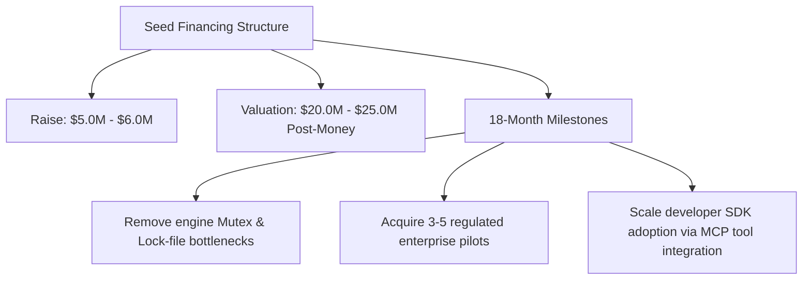

# Investor & Market Review: Seed Financing Viability & Valuation Memorandum

This memorandum evaluates the market potential, competitive risks, and investment feasibility of TraceDB, synthesizing the debate between **The Market Bull** (advocating for a $5.0M–$6.0M seed round based on GRC value capture) and **The Market Bear** (recommending a strong pass due to red-ocean competition, developer DX friction, and technical bottlenecks).

---

## 1. Thesis: The Bull Case for Seed Funding & GRC Value Capture

The primary thesis for investing in TraceDB is its focus on high-value enterprise compliance, risk management, and AI governance budgets.

### A. The Trillion-Dollar AI Governance Market Influx
*   **Rapid TAM Expansion:** The global AI governance market is projected to expand from less than **$1.0 billion in 2024** to **$5.78 billion by 2029**, showing a **Compound Annual Growth Rate (CAGR) of over 45%**.
*   **Mandatory Regulatory Drivers:** The **EU AI Act** imposes strict data governance guidelines, with fines up to **€35 million or 7% of global annual turnover** for non-compliance. Standards like **ISO/IEC 42001** require companies to maintain verifiable audit trails of all data fed to LLM contexts.
*   **GRC Budget Capture:** Unlike discretionary "developer tool" budgets which are highly price-sensitive, corporate security, compliance, and legal budgets are mandatory spend. By solving AI compliance at the database level, TraceDB can charge premium prices.

### B. Core Technical Moats
*   **Zero Sync Drift:** Glues relational, vector, text, and policy state into a single transaction epoch, removing synchronization latency between SQL databases and vector sidecars.
*   **Policy Pushdown with Exact Fallback:** The query planner dynamically falls back to exact scans when tenant records are small (e.g. `visible_records <= 32`, see [lib.rs](file:///Users/zgrogan/Repos/tracedb/crates/tracedb-planner/src/lib.rs#L111-L123)), avoiding approximate nearest neighbor (ANN) graph traversal failures on restricted datasets.
*   **Temporal Compliance Audits:** Supports point-in-time temporal queries (see [lib.rs](file:///Users/zgrogan/Repos/tracedb/crates/tracedb-temporal/src/lib.rs#L30-L32)), allowing compliance officers to verify what information was visible to an AI model at any point in history.

---

## 2. Antithesis: The Bear Case against Financing & Adoption Barriers

The bear case highlights significant market entry barriers, developer DX friction, and fundamental database scale limits.

### A. Fierce Red-Ocean Dynamics
*   **Postgres Dominance & pgvector:** PostgreSQL is the industry default database. The `pgvector` extension commoditizes vector search, allowing developers to add vector capabilities to their relational data without migrating databases.
*   **Heavily Funded Competitors:** Specialized vector databases (Pinecone, Qdrant, Milvus) have raised hundreds of millions of dollars and optimized scale using serverless compute/storage splits.
*   **Feature Dilution:** By trying to solve relational, vector, text, graph, and temporal storage concurrently, TraceDB spreads its engineering resources thin across 34 crates, risking sub-par performance in each category.

### B. Developer DX Friction & Integration Isolation
*   **Lack of SQL Support:** TraceDB lacks SQL driver compatibility. The SQL-ish parser is a rewriter that only supports simple `SELECT *` queries (see [lib.rs](file:///Users/zgrogan/Repos/tracedb/crates/tracedb-query/src/lib.rs#L4040-L4041)).
*   **No Ecosystem Tooling:** Relies on custom client SDKs (see [sdk.ts](file:///Users/zgrogan/Repos/tracedb/clients/typescript/src/sdk.ts#L459-L596)). Popular ORMs (Prisma, Drizzle, SQLAlchemy) and BI tools (Tableau, Looker) cannot connect to TraceDB.

### C. Technical and Concurrency Bottlenecks
*   **Performance Deficit vs. pgvector:** Benchmarks show that TraceDB has higher query latency, slower ingestion speeds, and a **5x larger storage footprint** compared to pgvector due to uncompressed JSON serialization and in-memory version vectors (see [kpi-closeout.md](file:///Users/zgrogan/Repos/tracedb/docs/benchmarks/kpi-closeout.md#L20-L37)).
*   **Single-Writer Mutex Locking:** All queries and mutations are serialized behind a global mutex lock `Arc<Mutex<TraceDb>>` (see [lib.rs](file:///Users/zgrogan/Repos/tracedb/crates/tracedb-server/src/lib.rs#L385-L451)).
*   **Stale Lock Failures:** Crashes leave lock files (`engine.write.lock`) on disk, requiring manual administrator intervention to delete the files before the database can restart.

---

## 3. Synthesis: Seed Round Structure & Valuation Verdict

Despite the operational risks of the early engine, the GRC compliance value proposition remains strong. We recommend participating in the seed financing round under the following terms:

### A. Seed Funding Strategy
*   **Round Size:** **$5.0M – $6.0M** (to support 18 months of runway).
*   **Post-Money Valuation:** **$20.0M – $25.0M** (reflecting a typical 15%–20% seed dilution).
*   **Use of Funds:**
    *   **70% Engineering / R&D:** Recruit systems engineers to remove engine serialization bottlenecks and transition to an MVCC async storage runtime.
    *   **20% GTM & Developer Relations:** Promote the local-first SDK and the Model Context Protocol (MCP) server integration to drive developer adoption.
    *   **10% Operations & compliance certifications (SOC 2, ISO 42001).**

### B. Valuation Milestones for Series A (18-Month Horizon)
1.  **Production Core Engine:** Remove the `Arc<Mutex<TraceDb>>` serialization bottleneck, switch write lock files to advisory locks, and optimize the storage layer.
2.  **Enterprise Staging pilots:** Secure 3 to 5 pilot contracts in regulated sectors (such as financial services, healthcare, or legal tech) demonstrating compliance enforcement.
3.  **Developer Traction:** Achieve 10,000+ monthly active developer installations of the local-first SDK and MCP tool server.
4.  **Financial Trajectory:** Reach **$1.0M ARR** through enterprise governance license fees and managed serverless hosting.
