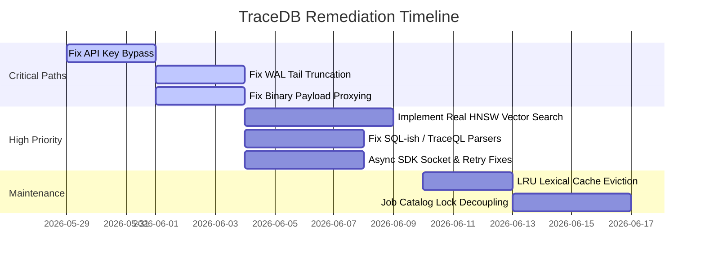

# TraceDB: Peer Review & Technical Assessment

**Status**: Alpha / WIP (Reviewed for Production-Readiness)
**Verdict**: **REJECT / UNSAFE FOR PRODUCTION**

This document provides a consolidated, hyper-critical peer review of TraceDB, evaluating the storage engine, query planner, network server, client SDKs, and test harnesses.

---

## Executive Summary

While TraceDB introduces a modular, log-structured design supporting hybrid vector, lexical, and graph queries, the codebase contains critical defects that compromise **data durability, tenant isolation, and record security**. The database is highly vulnerable to data corruption, authentication bypass, resource starvation, and memory leaks.

---

## 1. Security & Privacy Vulnerabilities

### 1.1 Gateway API Key Verification Bypass
* **Severity**: **Critical**
* **Location**: `crates/tracedb-gateway/src/lib.rs` (`handle_gateway_request_text`)
* **Critique**: The route authorize middleware (`authorize_route_and_meter`) is only executed for proxied routes (matching `is_proxied_gateway_route`). Public metadata routes are matched *before* the check:
  ```rust
  ("GET", "/v1/databases") => ok(json!({ "databases": config.catalog.databases().collect::<Vec<_>>() })),
  ("GET", "/v1/branches") => ok(json!({ "branches": config.catalog.branches().collect::<Vec<_>>() })),
  ```
  Any unauthenticated client can query `/v1/databases` and `/v1/branches` to read database topologies, branch configurations, internal region setup, and DNS endpoints.
* **Remediation**: Run token authorization for all routes, or structure Axum routes with native Router layers that place all endpoints behind a single auth middleware.

### 1.2 VisibilityOracle & Policy Layer is Bypassed
* **Severity**: **High**
* **Location**: `crates/tracedb-query/src/lib.rs`
* **Critique**: The security and governance policy system (defined as `VisibilityOracle` in `tracedb-policy` to handle ACLs, record hiding, and AI suppression tags like `suppress_from_ai`) is **never called** in `tracedb-query` during candidate materialization or query execution. Records marked as hidden or restricted are returned to any caller matching the `tenant_id`.
* **Remediation**: Integrate `VisibilityOracle::visible` directly into the candidate filter stage in `query_with_timing_internal`.

### 1.3 Co-mingled Multi-Tenancy (Simulated Isolation)
* **Severity**: **High**
* **Location**: `crates/tracedb-server/src/lib.rs`, `crates/tracedb-gateway/src/lib.rs`
* **Critique**: While the gateway catalog accepts different databases and branches, the underlying engine (`tracedb-server`) is single-tenant. It writes all database tables of the same name to the exact same physical directory and files. Isolation by database and branch is completely simulated, and data is co-mingled on disk.
* **Remediation**: Structurally separate storage folders on the engine using `database_id` and `branch_id` subdirectories.

---

## 2. Durability & Core Storage Flaws

### 2.1 WAL Torn Tail Recovery Bug (Valid Future Commits Discarded)
* **Severity**: **High**
* **Location**: `crates/tracedb-log/src/lib.rs` (`scan_file` and `Wal::open_with_encryption`)
* **Critique**: When the WAL scanner encounters a partially written/corrupted tail frame, it stops scanning and returns the entries read up to that offset. However, it does not truncate the WAL file. New frames are written *after* the corrupted tail. On subsequent restarts, the scanner stops at the same corrupted block, discarding all valid transactions appended after the recovery event.
* **Remediation**: The WAL recovery routine must truncate the file to the offset of the torn tail (`std::fs::File::set_len`) before accepting new writes.

### 2.2 Non-Durable WAL Commits in Keeper
* **Severity**: **Medium**
* **Location**: `crates/tracedb-keeper/src/lib.rs`
* **Critique**: `BranchWalService::persist` writes the log using `fs::write` then renames the file without calling `fsync` or `sync_all` on the file descriptor or parent directory. A crash can result in file table corruption or an empty WAL. Furthermore, rewriting the entire commit log on every write has $O(N)$ write overhead.
* **Remediation**: Use an append-only format and call `.sync_all()` on the WAL file.

### 2.3 Broken Compaction
* **Severity**: **Medium**
* **Location**: `crates/tracedb-query/src/lib.rs` (`compact()`, `publish_segment()`)
* **Critique**: Compaction generates a new compacted segment but never deletes or marks old source segments as superseded in the manifest. Read queries scan all segments, yielding duplicate records, read amplification, and incorrect BM25 search rankings.
* **Remediation**: Update the manifest to remove compacted source files or flag them as `Superseded`.

---

## 3. Concurrency, I/O, & Network Bottlenecks

### 3.1 Gateway Conversion of Binary Requests to UTF-8
* **Severity**: **Critical**
* **Location**: `crates/tracedb-gateway/src/lib.rs` (`request_text_from_parts`)
* **Critique**: The gateway reads request bodies as strings via `String::from_utf8_lossy` before proxying. This permanently corrupts any raw binary data (such as compressed vectors or serialized data payloads). Furthermore, replacing invalid bytes with 3-byte unicode characters (`\u{FFFD}`) causes the body size to expand. Since the proxy calculates the header `Content-Length` from the original raw binary size, it sends a payload larger than the declared content length. This leaves trailing bytes on the TCP socket, causing lockups and enabling HTTP request smuggling.
* **Remediation**: Stop converting requests to text representation. Pass raw `Bytes` directly to the engine proxy.

### 3.2 Global Database Write-Lock Contention from Background Jobs
* **Severity**: **High**
* **Location**: `crates/tracedb-server/src/lib.rs`
* **Critique**: The server wraps the main `TraceDb` in a single `Arc<RwLock<TraceDb>>`. Workers checking, leasing, or heartbeating jobs acquire the database-wide write lock, blocking all read/write queries.
* **Remediation**: Decouple the job queue catalog from the database data-plane state.

### 3.3 Synchronous TCP Stream Blockage in Async Contexts
* **Severity**: **High**
* **Location**: `crates/tracedb-gateway/src/lib.rs` (`proxy_engine_request_with_id`)
* **Critique**: The gateway uses synchronous `std::net::TcpStream` to proxy requests. Because this happens in the fallback handler of an async Axum context, each concurrent request blocks a Tokio worker thread, easily starving the thread pool under light load.
* **Remediation**: Use an async HTTP client (e.g., `reqwest` or `hyper`) to proxy requests asynchronously.

---

## 4. Query Engine & Search Deficiencies

### 4.1 Mocked Indexing & Linear Flat Scans
* **Severity**: **High**
* **Critique**:
  * **Vector**: Build time computes an HNSW graph costing $O(N^2 \cdot D)$ cosine similarity checks, but the search path completely ignores the graph and loops over all records as a brute-force scan.
  * **Graph**: Neighbor searches scan a flat `Vec<Edge>` linearly.
  * **Temporal**: Evaluated via flat loops over all records, parsing the raw JSON `"valid_from"` and `"valid_to"` fields dynamically.
* **Remediation**: Implement actual graph traversal for HNSW search, adjacency lists for graph routing, and utilize the index structures instead of flat scans.

### 4.2 Unbounded Memory Leak in Lexical Cache
* **Severity**: **Medium**
* **Location**: `crates/tracedb-query/src/lib.rs`
* **Critique**: The `lexical_cache` is a `BTreeMap` mapping predicates to `PreparedTextCorpus`. Predicate-heavy queries (e.g., user-specific or timestamp filters) allocate a new copy of the tokenized text corpus in the cache. Without size limits or eviction, this leads to an OOM crash.
* **Remediation**: Implement an LRU eviction policy for `lexical_cache`.

### 4.3 Parser Correctness Vulnerabilities
* **Severity**: **Medium**
* **Critique**:
  * **TraceQL**: Splitting inputs using `.lines()` breaks JSON string literals containing newlines.
  * **GraphQL**: Bypasses comment checking; comments containing braces (`# comment }`) corrupt the delimiter parser.
  * **SQL-ish**: Splitting predicates strictly on `AND` silently swallows the `OR` keyword, parsing expressions like `WHERE tenant_id = 'a' OR x = y` as a literal tenant string value.
* **Remediation**: Use proper lexer-based parsers (e.g., with `nom`).

---

## 5. Client SDK & Testing Flaws

### 5.1 Connection Failures and Timeouts Bypass Retries
* **Severity**: **High**
* **Critique**:
  * **TS SDK**: `resolvedFetch` is not wrapped in `try/catch`. Socket hangups, DNS lookup errors, or timeouts reject the promise and bypass retries.
  * **Python SDK**: Only catches `HTTPError`. URLErrors (network down, socket reset) bypass retries.
  * **Rust SDK**: Socket connection IO errors are not mapped to retryable errors.
* **Remediation**: Capture network exceptions/IO errors in retry checks.

### 5.2 Thread-per-Request Async Model (Rust SDK)
* **Severity**: **High**
* **Location**: `crates/tracedb-sdk/src/lib.rs`
* **Critique**: The async client spawns a physical OS thread (`thread::spawn`) for *every request*. Running high concurrency can exhaust process PIDs and crash the runtime.
* **Remediation**: Use a native async HTTP engine with Tokio and connection pooling.

### 5.3 Hot Tight-Loop Retries (Thundering Herd)
* **Severity**: **Medium**
* **Critique**: SDK retry loops run immediately upon failure. This creates a thundering herd storm against a struggling server.
* **Remediation**: Implement exponential backoff with jitter.

---

## Remediation Checklist & Priority Paths


